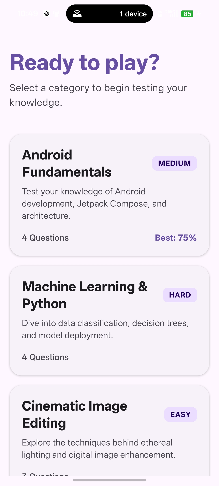
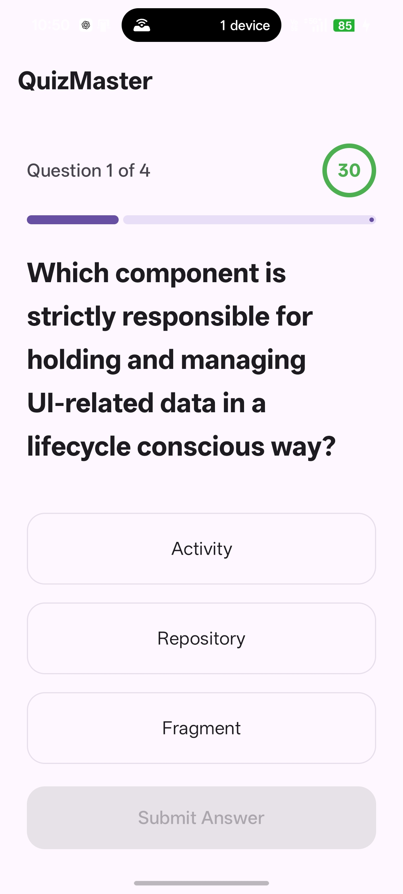
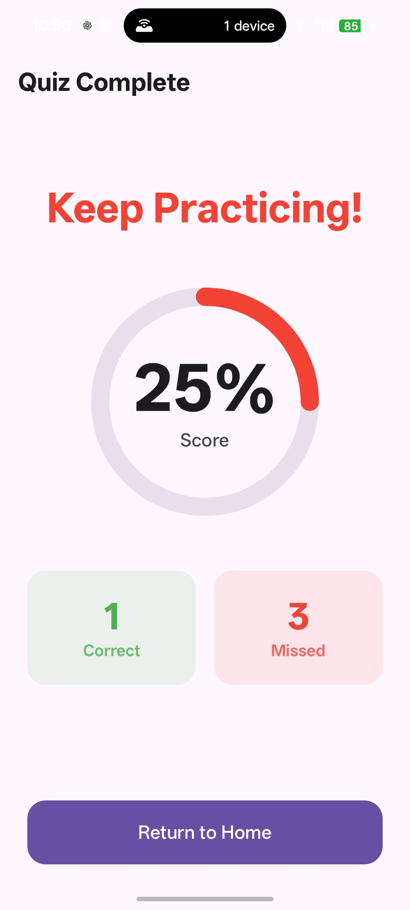

# 🚀 QuizMaster Android

**A premium, high-performance quiz engine built with Jetpack Compose & MVVM.**

---

### 📱 Preview
| Home | Quiz Selection | Result |
| :---: | :---: | :---: |
|  |  |  |

## ✨ Key Highlights
- **Fluid UX:** Uses `AnimatedContent` for smooth transitions between questions.
- **Precision Timing:** An animated circular countdown system with adaptive color-coding.
- **Data Persistence:** Built with **Room & DataStore** for lightning-fast, local-first score tracking.
- **Randomized Logic:** Every quiz session is fresh, thanks to our intelligent shuffle engine.

## 🛠 Tech Stack
- **UI:** Jetpack Compose + Material3
- **State Management:** ViewModel + StateFlow
- **Database:** DataStore Preferences
- **Threading:** Kotlin Coroutines
- **Pattern:** Clean Architecture (MVVM)

## 📦 How to run
1. Clone the repo: `git clone https://github.com/abhi2004-dev/CODSOFT-QuizApp.git`
2. Open in **Android Studio Ladybug+**.
3. Sync the Gradle files.
4. Build, Deploy, and Test!

---
*Built with passion by Abhi.* 💻